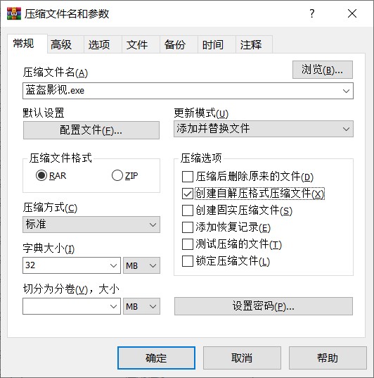
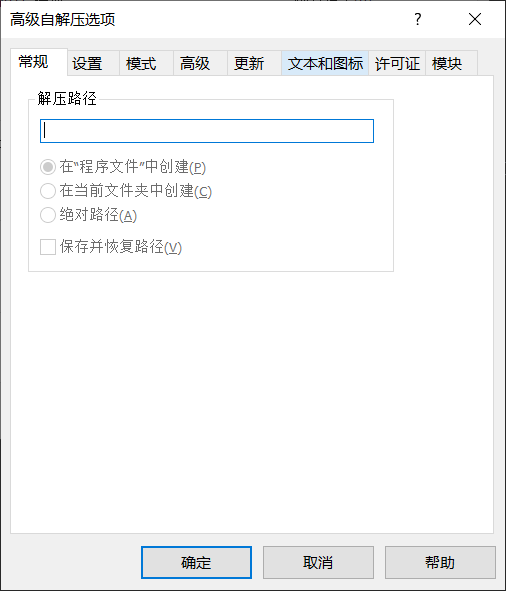
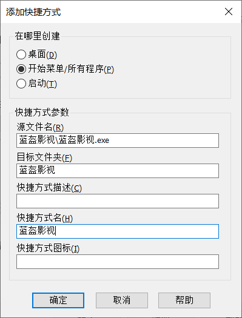
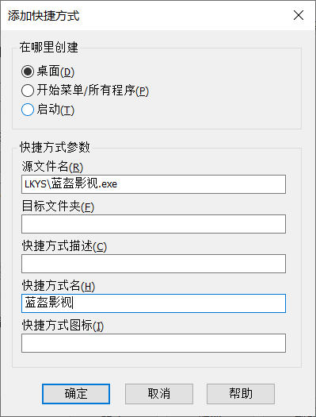
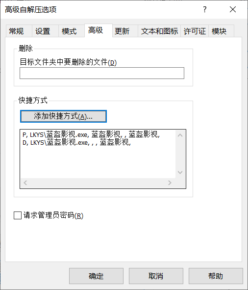
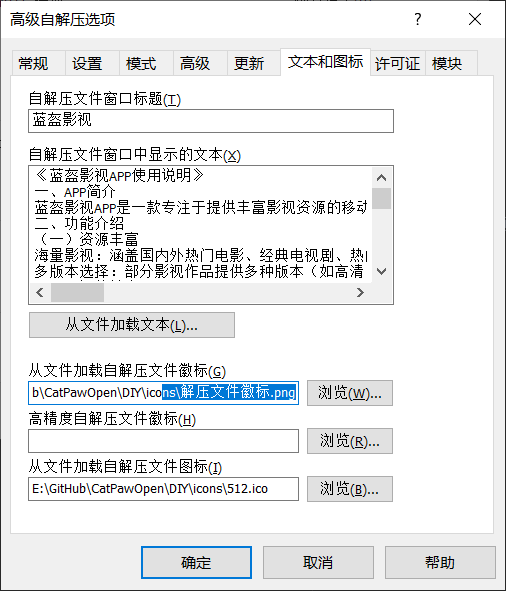

IOS:

logo:替换Payload\Runner.app\Assets.car文件

修改软件名/版本号：使用爱思助手修改Payload\Runner.app\Info.plist

内置源：Payload\Runner.app\Frameworks\App.framework\flutter_assets\asset\js

windows:

内置源：windows:data\flutter_assets\asset\js

文件md5在线计算:http://www.metools.info/other/o21.html

Windows环境下计算文件md5 命令：certutil -hashfile index.config.js MD5回车

创建自压缩exe文件：
安装WinRAR。》
直接在文件夹上右键，创建压缩包》

在弹出的窗口中，选择“创建自解压格式压缩文件”。》

点击“高级”选项卡，选择“自解压选项”。》

高级：添加快捷方式{D, 蓝盔影视\蓝盔影视.exe, , , 蓝盔影视,}{P, 蓝盔影视\蓝盔影视.exe, 蓝盔影视, , 蓝盔影视,} 》

文本和图标：标题（蓝盔影视）文本内容（蓝盔影视是一款专注于提供丰富影视资源的应用。它致力于为用户提供海量的电影、电视剧、综艺节目、动漫等各类影视作品，满足用户随时随地观看影视的需求。通过简洁的界面设计和强大的搜索功能，用户可以轻松找到自己喜爱的影视内容，并享受高清流畅的播放体验。）、文本和图标：从文件加载文本（app说明.txt)
