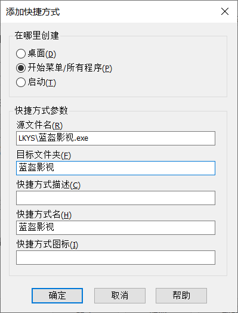

IOS:

logo:替换Payload\Runner.app\Assets.car文件

修改软件名/版本号：使用爱思助手修改Payload\Runner.app\Info.plist

内置源：Payload\Runner.app\Frameworks\App.framework\flutter_assets\asset\js

windows:

内置源：windows:data\flutter_assets\asset\js

文件md5在线计算:http://www.metools.info/other/o21.html

Windows环境下计算文件md5 命令：certutil -hashfile index.config.js MD5回车

创建自压缩exe文件：
安装WinRAR。》
直接在文件夹上右键，创建压缩包》

在弹出的窗口中，选择“创建自解压格式压缩文件”。》

点击“高级”选项卡，选择“自解压选项”。》

高级：添加快捷方式{P, LKYS\蓝盔影视.exe, 蓝盔影视, , 蓝盔影视, & D, LKYS\蓝盔影视.exe, , , 蓝盔影视, } 》

文本和图标：标题（蓝盔影视）文本内容（app说明.txt),修改图标文件。1`